Configured to be used in a specific group chat room, the general use case is around agents who may be running late on a call and need to adjust break/lunch without needing a supervisor. This can be applied to any activity that the agent has as well. The bot flow first requests the email of the agent. Once given, it fetches the agent's schedule for the day and will ask which activity it wants to adjust. Once selected, the bot will ask the number of minutes the activity will be adjusted, which then the bot will adjust the schedule.

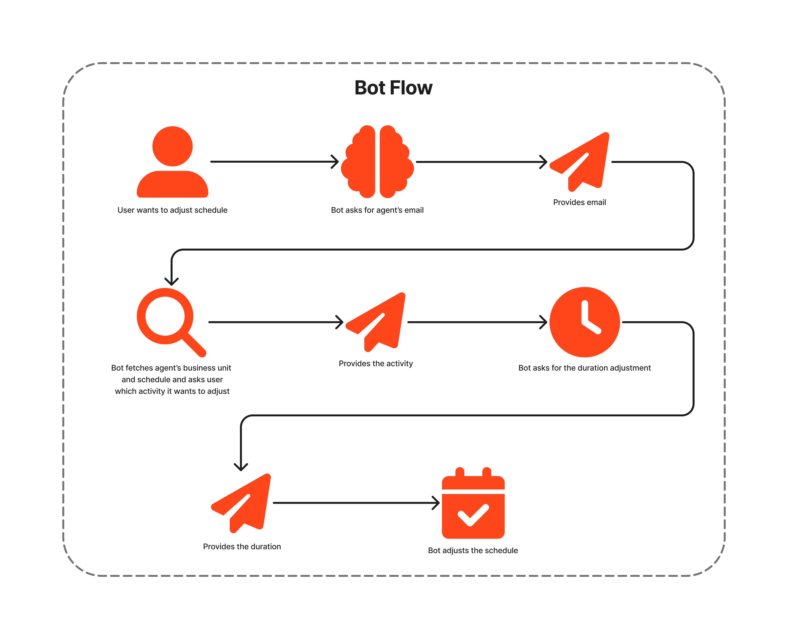

The conversation only occurs within the group chat due to the implementation of open messaging, trigger, and webhook chat notification. The trigger allows the message to be sent to an open messaging that allows the message to route into the bot flow. The bot flow's response is then sent to the Lambda that sends the response to a webhook chat notification that sends it to the group chat. Only the user's message activates the trigger.

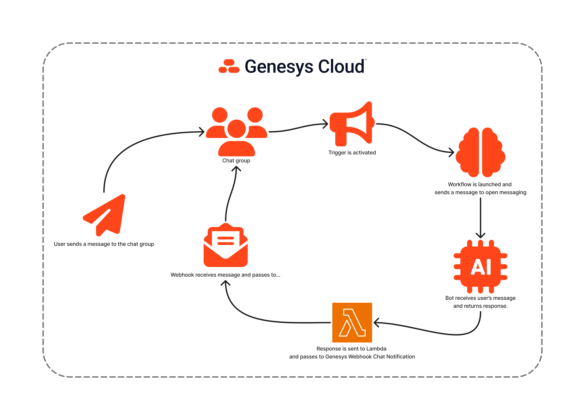

## Solution Components

- **Genesys Cloud** - a suite of Genesys cloud services for enterprise-grade communications, collaboration, and contact center management.
  - **CX as Code** - a tool to declaratively manage Genesys Cloud resources and configuration across organizations using Terraform by HashiCorp.
  - **Data Action** - provides the integration point to invoke a third-party REST web service, AWS lambda, or functions.
  - **Architect flows** - a drag and drop web-based design tool, dictates how Genesys Cloud handles inbound or outbound interactions.
  - **Process Automation Triggers** - a rules engine that enables you to automate workflows when specific events occur.
  - **Webhook (Chat Notification)** - an integration tool that sends automated chats to Genesys Cloud chat rooms from an application of your choice.
  - **Open Messaging** - an integration tool that facilitates messaging with third-party systems and external messaging services.
- **[Node.js](https://nodejs.org/en/ "Opens the NodeJS website")** - An open-source, cross-platform JavaScript runtime environment.
- **[AWS Lambda](https://aws.amazon.com/lambda/ "Opens the AWS Lambda website")** - A serverless computing service for running code without creating or maintaining the underlying infrastructure.

## Prerequisites

- Specialized Knowledge
  - Administrator-level knowledge of Genesys Cloud.
  - Basic knowledge of Genesys Cloud Architect.
  - Basic knowledge of the Genesys Cloud API.
  - Basic knowledge of AWS.
  - Basic knowledge of Node.js.
- Genesys Account Requirements
  - A Genesys Cloud license (CX 1 Digital or greater with Virtual Agent). For more information, see [Genesys Cloud Pricing](https://www.genesys.com/pricing "Goes to the Genesys Cloud Pricing page").
  - Master Admin role in Genesys Cloud. For more information, see [Roles and permissions overview](https://help.genesys.cloud/?p=24360 "Goes to the roles and permissions overview in the Genesys Cloud Resource Center") in the Genesys Cloud Resource Center.
  - [OAuth Client](https://help.genesys.cloud/articles/create-an-oauth-client/ "Goes to the Create an OAuth Client article") with the Master Admin role.
- AWS Account Requirements
  - Account role that has access to AWS Lambda.

## Implementation Steps

This blueprint has 2 implementation steps that allows you to do this manually or use Terraform _(which is highly recommended)_.

- [Preparation Steps](#preparation-steps "Goes to the Preparation Step section")
    1. [Clone the Repository](#clone-the-repository "Goes to the Clone the Repository section")
    2. [Install Dependencies](#install-dependencies "Goes to the Install Dependencies section")
    3. [Create OAuth Client Credentials](#create-oauth-client-credentials "Goes to the Create OAuth Client Credentials section")
    4. [Create a Group](#create-a-group "Goes to the Create a Group section")
    5. [Create a Generic Webhook Integration](#create-a-generic-webhook-integration "Goes to the Create a Generic Webhook Integration section")
- [Manual Implementation](#manual-implementation "Goes to the Manual Implementation section")
    1. [Create the Lambda](#create-the-lambda "Goes to the Create the Lambda section")
    2. [Create Open Messaging Integration](#create-a-generic-webhook-integration "Goes to the Create Open Messaging Integration section")
    3. [Create Genesys Cloud Data Action Integration](#create-genesys-cloud-data-action-integration "Goes to the Create Genesys Cloud Data Action Integration section")
    4. [Create Functions Data Action Integration](#create-functions-data-action-integration "Goes to the Create Functions Data Action Integration section")
    5. [Create and Import the Data Actions](#create-and-import-the-data-actions "Goes to the Create and Import the Data Actions section")
    6. [Create a Data Table](#create-a-data-table "Goes to the Create a Data Table section")
    7. [Create and Import the Flows](#create-and-import-the-flows "Goes to the Create and Import the Flows section")
    8. [Create a Trigger](#create-a-trigger "Goes to the Create a Trigger section")
- [Using Terraform](#using-terraform "Goes to the Using Terraform section")
    1. [Configure the Terraform Project](#configure-the-terraform-project "Goes to the Configure the Terraform Project section")
    2. [Run Terraform](#run-terraform "Goes to the Run Terraform section")
- [Final Configuration Step: Add Message Routing](#final-configuration-step-add-message-routing "Goes to the Add Message Routing section")
- [Testing](#testing "Goes to the Testing section")

## Preparation Steps

### Clone the Repository

Clone the [wfm-activity-change-blueprint](https://github.com/GenesysCloudBlueprints/wfm-activity-change-blueprint "Goes to the wfm-activity-change-blueprint repository in GitHub") repository in your local machine. You can also run this git command to clone the repository:

```bash
git clone https://github.com/GenesysCloudBlueprints/wfm-activity-change-blueprint.git
```

### Install Dependencies

This blueprint requires the following tools to be installed on your local machine:

- [Terraform](https://developer.hashicorp.com/terraform "Goes to the Terraform website") - for the [Using Terraform](#using-terraform "Goes to the Using Terraform section") step.
- [AWS CLI](https://docs.aws.amazon.com/cli/latest/userguide/getting-started-install.html "Goes to the installation instructions of AWS CLI") - will be needed in Terraform to provide AWS credentials.
- [Node.js](https://nodejs.org/en/ "Opens the NodeJS website") (Optional) - LTS or version 22 or greater. Used to modify the function and lambda source code.

### Create OAuth Client Credentials

The use of an OAuth Client is required for the Genesys Cloud Integrations and Terraform to create your Genesys Cloud resources. Instructions on how to create one is in this [article](https://help.genesys.cloud/articles/create-an-oauth-client/ "Goes to create an OAuth Client in Genesys Cloud Resource Center"). Do take note of and store securely both the generated `Client ID` and `Client Secret`.

### Create a Group

You only need to create a group with the targeted agents as members. The guide to create a group can be seen in our [article here](https://help.genesys.cloud/articles/create-group/ "Goes to the Create Group article in the Genesys Cloud Resource Center"). Take note of the ID of the group which can be seen in the URL while you are viewing the group details. You can get the group's ID by viewing its profile and check its URL. The URL's format looks something like this: `https://{genesys-domain}/directory/#/admin/groupprofile/{group-id}`.

### Create a Generic Webhook Integration

Instructions on how to create a Generic Webhook Integration can be found in this [article](https://help.genesys.cloud/articles/add-webhook-integration/ "Goes to the Add a webhook integration article in the Genesys Cloud Resource Center"). When creating the integration, take note of the `Webhook URL` and add a mapping that maps the received message to the [group you just created](#create-a-group "Goes to the Create a Group section").

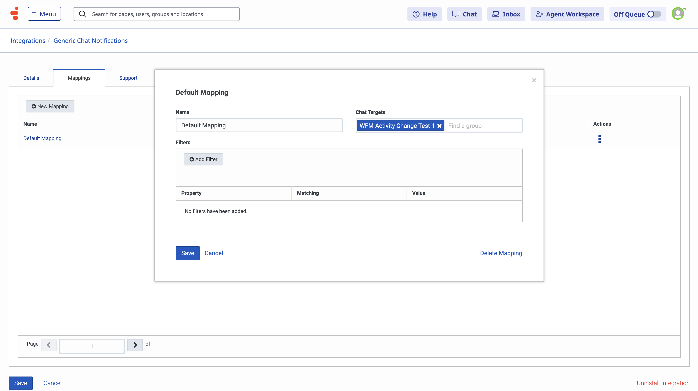

#### Send Message to Webhook

Once you have created the group, webhook, and the mapping, send a payload to the webhook by following the [guide here](https://help.genesys.cloud/articles/set-up-an-integration-using-the-generic-webhook/ "Goes to the Set up an integration using the Generic Webhook article in the Genesys Cloud Resource Center"). Once sent, view the chat group and **take note of the ID of the Generic chat** by viewing the profile. You can get its ID from the URL.

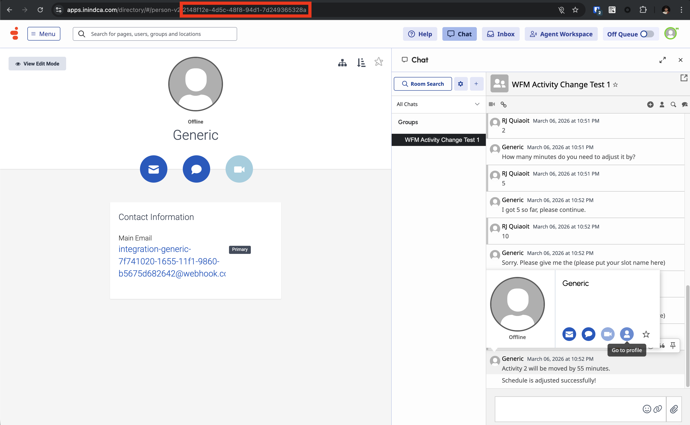

## Manual Implementation

### Create the Lambda

#### Building the Source Code (Optional)

Go to the `src/lambda_code_source` folder and initialize the project by running the command `npm install`. After that, you may zip the folder for deployment of the lambda. The `lambda_code.zip` file inside the `src` directory already contains the dependencies of the project and can be uploaded immediately.

#### Uploading the Source Code

AWS has provided a [documentation on how you would deploy your source code to a Lambda function](https://docs.aws.amazon.com/lambda/latest/dg/nodejs-package.html#nodejs-package-create-update "Goes to the AWS Lambda Developer Guide on Deploy Node.js Lambda functions with .zip file archives"). Ensure that the function that you will create has a Node.js runtime (`nodejs22.x` is recommended).

You also have to ensure that the Lambda also generates a webhook URL by [following this guide](https://docs.aws.amazon.com/lambda/latest/dg/urls-webhook-tutorial.html "Goes to the Tutorial: Creating a webhook endpoint using a Lambda function URL article in AWS Lambda Developer Guide."). **Do take note of the URL generated**. It may look something like this: `https://{some-uid}.lambda-url.{aws-region}.on.aws/`. For demonstration purposes, you don't need to setup the secret key to verify the incoming payloads but is recommended when you want to fully develop the solution into production.

#### Provide the Environment Variables

Once you have deployed the code, go to your function. Then go to **Configuration** > **Environment Variables**, and set the key `DESTINATION_WEBHOOK_URL` with its value as the webhook URL generated from [creating the Generic Webhook Integration](#create-a-generic-webhook-integration "Goes to the Create a Generic Webhook Integration section").

### Create Open Messaging Integration

You can create an Open Messaging Integration by following the [guide here](https://help.genesys.cloud/articles/configure-an-open-messaging-integration/ "Goes to the Configure an open messaging integration article in the Genesys Cloud Resource Center"). Provide the Lambda Webhook Endpoint URL we created from [creating the Lambda](#create-the-lambda ""). You may arbitrarily put any value in the `Outbound Notification Webhook Signature Secret Token` for demonstration purposes.

### Create Genesys Cloud Data Action Integration

You can create a Genesys Cloud Data Action Integration by following the [guide here with the Genesys Cloud tab](https://help.genesys.cloud/articles/add-a-data-actions-integration/ "Goes to the Add a data actions integration article in the Genesys Cloud Resource Center"). Provide the `Client ID` and `Client Secret` [we created](#create-oauth-client-credentials "Goes to the Create OAuth Client Credentials section").

### Create Functions Data Action Integration

You can create a Functions Data Action Integration by following the [guide here with the Function tab](https://help.genesys.cloud/articles/add-a-data-actions-integration/ "Goes to the Add a data actions integration article in the Genesys Cloud Resource Center"). Provide the following fields in the **Credentials** tab:

- `clientId` - The Genesys Cloud [client credential grant id](#create-oauth-client-credentials "Goes to the Create OAuth Client Credentials section") that CX as Code executes against.
- `clientSecret` - The Genesys Cloud [client credential grant secret](#create-oauth-client-credentials "Goes to the Create OAuth Client Credentials section") that CX as Code executes against.
- `region` - The region where your Genesys Cloud organization is deployed. This will be used against the Genesys Cloud Javascript SDK. To get the appropriate value for your region, check the `platformClient.PureCloudRegionHosts` of the [Javascipt SDK documentation](https://mypurecloud.github.io/platform-client-sdk-javascript/ "Goes to the Genesys Cloud Platform API JavaScript Client documentation"). eg. `us_east_1`, `eu_west_1`, `ap_southeast_2`, etc. If you are testing against a test organization, you may enter `inindca.com`.

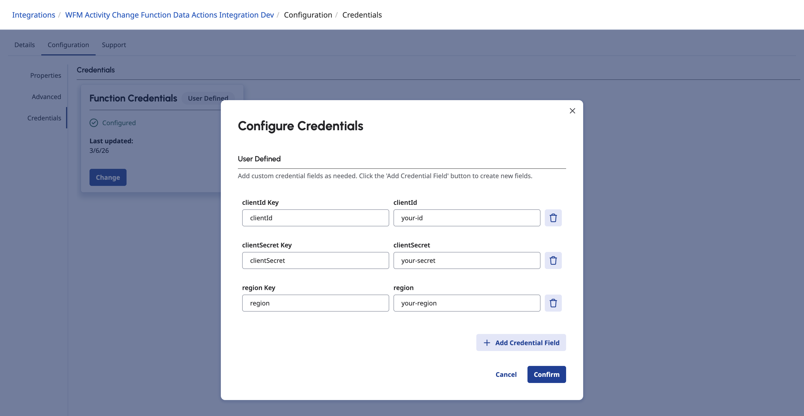

### Create and Import the Data Actions

All Data Actions to import (that are in JSON files) are in the `/exports` folder in the [blueprint repository](#clone-the-repository "Goes to the Clone the Repository section") namely:

- `GetAgentBusinessUnitDataAction.json` - gets the business unit of a given agent.
- `GetAgentScheduleDataAction.json` - gets the schedule of a given agent.
- `InvokeOpenMessagingDataAction.json` - sends a message to a given Genesys Cloud Open Message Integration.

You can import these data actions using the following steps:

1. In Genesys Cloud, navigate to **IT and Integrations** > **Data Actions** and click **Import**.
2. Select the json files and associate with the [**Genesys Cloud Data Action** integration we just created](#create-genesys-cloud-data-action-integration "Goes to the Create Genesys Cloud Data Action Integration section").
3. Click **Import Action**.
4. Click **Save & Publish**.

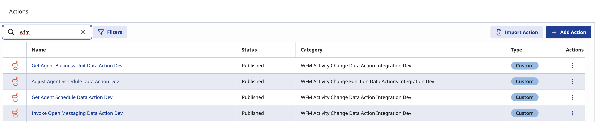

For the Function Data Action that we'll be creating, follow these steps:

1. In Genesys Cloud, navigate to **IT and Integrations** > **Data Actions** and click **Add Action**.
2. Select the [Function Data Action Integration we just created](#create-functions-data-action-integration "Goes to the Create Functions Data Action Integration section").
3. Name the action as `Adjust Agent Schedule` as that's the function that we'll be creating. Then, click **Add**.
4. Go to **Setup** > **Contracts**, and provide the Input Contract in JSON below:

    ```json
    {
        "type": "object",
        "properties": {
            "activityCodeId": {
                "type": "string"
            },
            "agentId": {
                "type": "string"
            },
            "businessUnitId": {
                "type": "string"
            },
            "description": {
                "type": "string"
            },
            "lengthMinutes": {
                "type": "string"
            },
            "paid": {
                "type": "boolean"
            },
            "startDate": {
                "type": "string"
            },
            "windowEnd": {
            "   type": "string"
            },
            "windowStart": {
                "type": "string"
            }
        }
    }
    ```

5. Go to **Configuration**. Set the HTTP Method to `POST`, put the integration ID of the [Function Data Action Integration we just created](#create-functions-data-action-integration "Goes to the Create Functions Data Action Integration section") to the Request URL Template and set the Request Body Template to the one below:

    ```json
    {
        "businessUnitId": "$!{input.businessUnitId}",
        "agentId": "$!{input.agentId}",
        "windowStart": "$!{input.windowStart}",
        "windowEnd": "$!{input.windowEnd}",
        "clientId": "$!{credentials.clientId}",
        "clientSecret": "$!{credentials.clientSecret}",
        "gcRegion": "$!{credentials.region}",
        "shiftChange": {
            "startDate": "${input.startDate}",
            "lengthMinutes": ${input.lengthMinutes},
            "description": "${input.description}",
            "activityCodeId": "${input.activityCodeId}",
            "paid": ${input.paid}
        }
    }
    ```

6. Go to **Function**. Upload the function code with the zip file `function_code.zip` that is located in `src` directory of the [repository](#clone-the-repository "Goes to the Clone the Repository section").

    :::primary
    If you want to inspect or make any changes to the function, you may check its source code in `src/function_code_source`. Run `npm install` to initialize and install its dependencies.
    :::

7. Set the Handler to `handler.updateSchedule` and the runtime to `nodejs22.x`.
8. Once done, click **Save and Publish**.

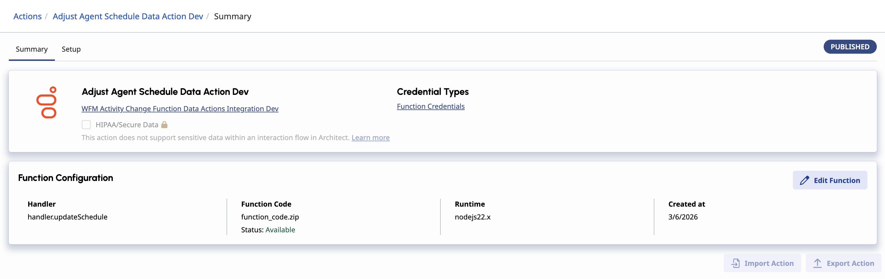

### Create a Data Table

Creating a data table can be found on this [article here](https://help.genesys.cloud/articles/create-a-data-table/ "Goes to the Create a Data Table article in the Genesys Cloud Resource Center"). This data table will contain the activity codes from the WFM of your given business unit. You may fetch them with [`/api/v2/workforcemanagement/businessunits/{businessUnitId}/activitycodes`](https://developer.genesys.cloud/devapps/api-explorer#get-api-v2-workforcemanagement-businessunits--businessUnitId--activitycodes "Goes to the Genesys Cloud Developer Center's API Explorer"). You will need to create a table with the following structure.

- `ActivityCode` - the Reference Key Label for the data table and the ID of the given activity code.
- `Name` - _string_, name of the activity code.
- `Category` - _string_, category of the activity code.
- `Paid` - _boolean_, toggle if a specific activity is paid or not.

A screenshot of the default activity codes is seen here:

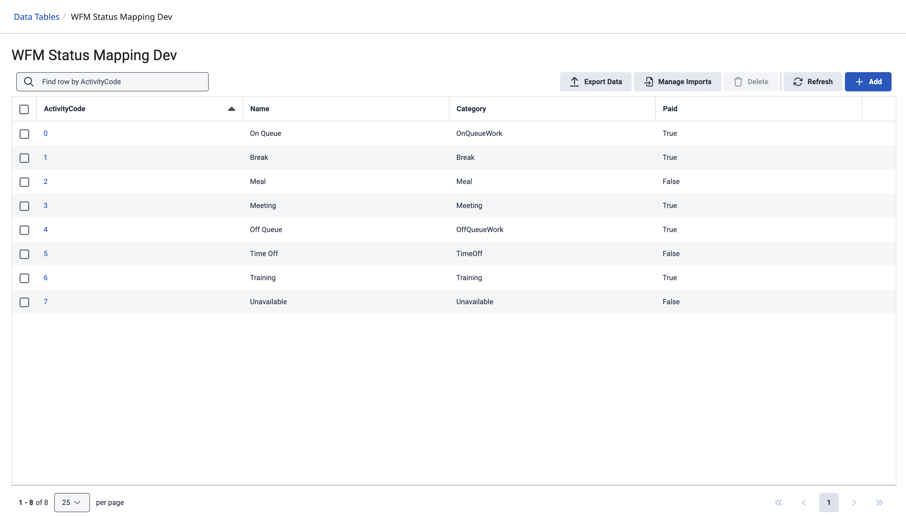

### Create and Import the Flows

There are additional files in the `/exports` folder in the [blueprint repository](#clone-the-repository "Goes to the Clone the Repository section") that contains the flows needed:

1. `WFMActivityChangeBotFlow.i3BotFlow` - the bot flow itself that asks the user on what they want to do.

2. `WFMActivityChangeInboundMessageFlow.i3InboundMessage`- the inbound message flow that utilizes the bot flow.

3. `WFMActivityChangeWorkflow.i3WorkFlow` - the workflow that runs when a trigger is activated that sends the message of the user to the open message integration.

#### Import the Bot Flow

1. In Genesys Cloud, navigate to **Orchestration** > **Architect** > **Flows:Bot Flow** and click **Add**.

2. Enter a name for the inbound message flow and click **Create Flow**.

3. From the **Save** menu, click **Import**.

4. Select the `WFMActivityChangeBotFlow.i3BotFlow` file from `/exports` and click **Import**.

5. Ensure that the data actions in the bot flow are connected to the [data actions we just created](#create-and-import-the-data-actions "Goes to the Create and Import the Data Actions section") and have the given Inputs and Success Outputs.

6. Click **Save** and then click **Publish**.

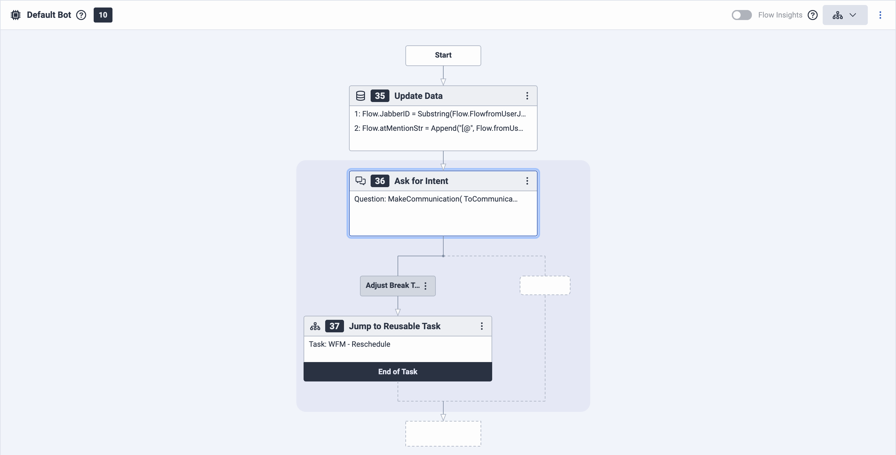
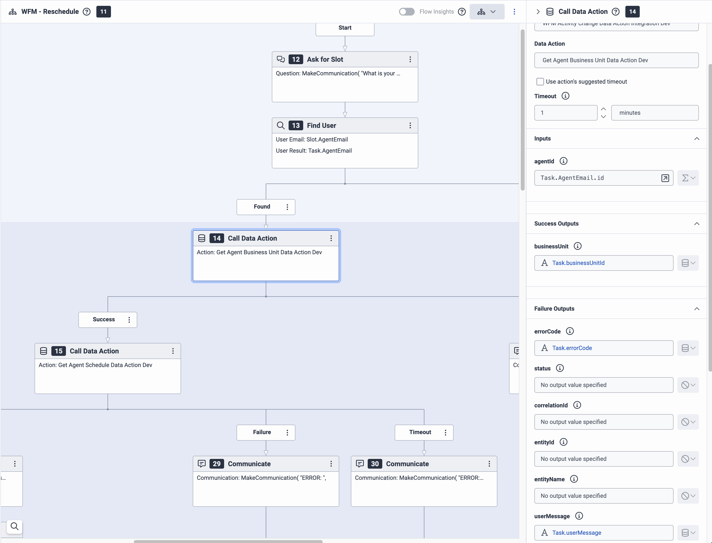
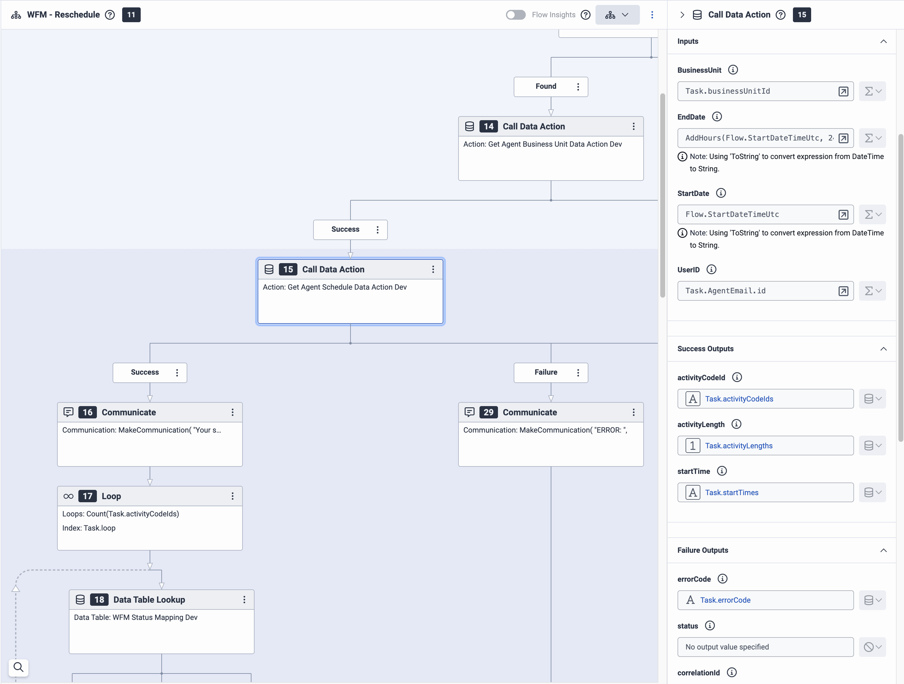
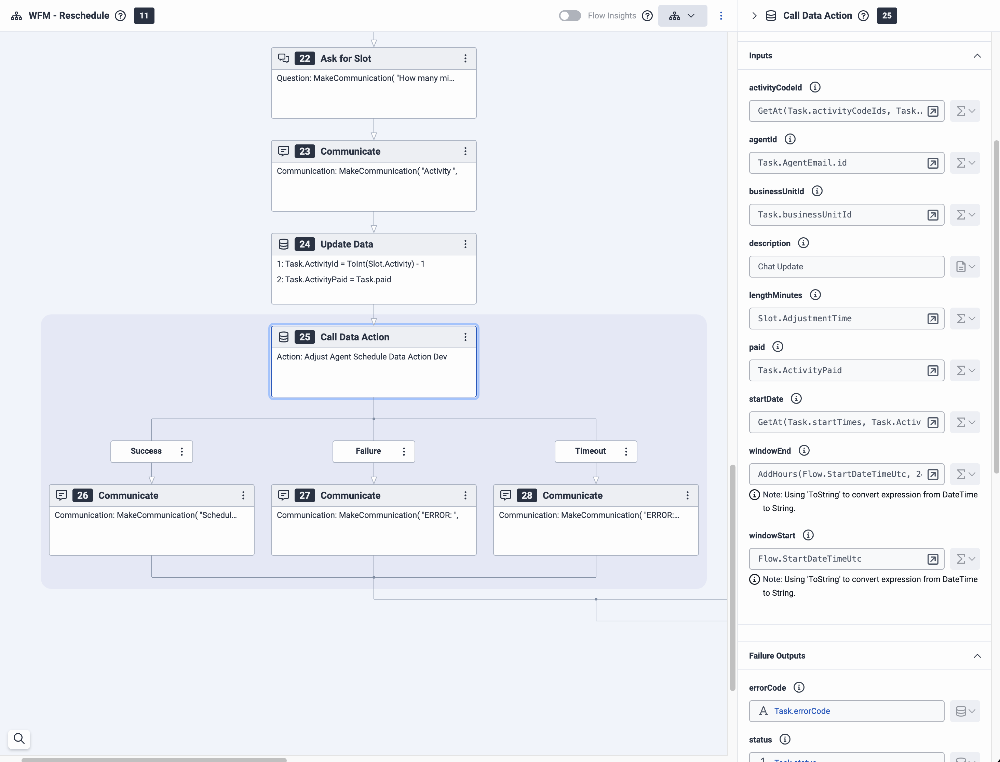

#### Import the Inbound Message Flow

1. In Genesys Cloud, navigate to **Orchestration** > **Architect** > **Flows:Inbound Message Flow** and click **Add**.

2. Enter a name for the inbound message flow and click **Create Flow**.

3. From the **Save** menu, click **Import**.

4. Select the `WFMActivityChangeInboundMessageFlow.i3InboundMessage` file from `/exports` and click **Import**.

5. Ensure that the `Call Bot Flow` is connected to the [bot flow we just created](#import-the-bot-flow "Goes to the Import the Bot Flow section") and have the given Inputs and Success Outputs.

6. Click **Save** and then click **Publish**.

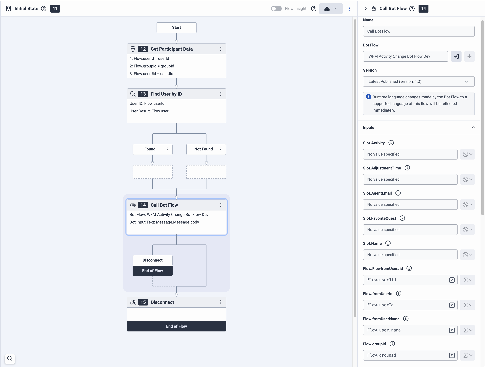

#### Import the Workflow

1. In Genesys Cloud, navigate to **Orchestration** > **Architect** > **Flows:Bot Flow** and click **Add**.

2. Enter a name for the inbound message flow and click **Create Flow**.

3. From the **Save** menu, click **Import**.

4. Select the `WFMActivityChangeWorkflow.i3WorkFlow` file from `/exports` and click **Import**.

5. Ensure that the data action in the workflow is connected to the [data actions we just created](#create-and-import-the-data-actions "Goes to the Create and Import the Data Actions section"), particularly the Invoke Open Messaging, and have the given Inputs and Success Outputs. Note that the Integration ID in the input is the ID of the [Open Messaging Integration](#create-open-messaging-integration "Goes to the Create Open Messaging Integration section").

6. Click **Save** and then click **Publish**.

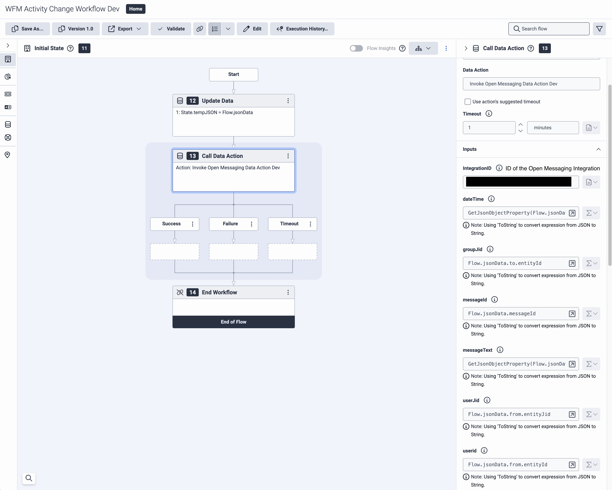

### Create a Trigger

Creating a trigger can be seen in [this article](https://help.genesys.cloud/articles/create-a-trigger/ "Goes to Create a Trigger article in the Genesys Cloud Resource Center"). Use the topic `v2.detail.events.collaboratechat.group.{id}.messages` with the [workflow we just created](#import-the-workflow "Goes to the Import the Workflow section") using the `Json` data format. Then, add two conditions. The first one is `to.entityId` with `Equals (==)` Operator with value of [ID of the group](#create-a-group "Goes to the Create a Group section") and the second one is `from.entityID` with `Not Equals (!=)` Operator with value of [ID of the Generic](#send-message-to-webhook "Goes to the Send Message to Webhook section").

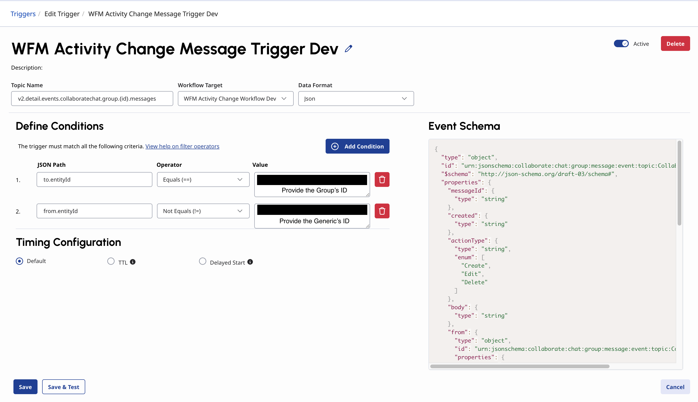

## Using Terraform

### Configure the Terraform Project

In the root directory of the repository, open `dev.auto.tfvars` file, where you need to set the following:

- `client_id` - The Genesys Cloud [client credential grant id](#create-oauth-client-credentials "Goes to the Create OAuth Client Credentials section") that CX as Code executes against.
- `client_secret` - The Genesys Cloud [client credential grant secret](#create-oauth-client-credentials "Goes to the Create OAuth Client Credentials section") that CX as Code executes against.
- `genesys_cloud_region` - The region where your Genesys Cloud organization is deployed. This will be used against the Genesys Cloud Javascript SDK. To get the appropriate value for your region, check the `platformClient.PureCloudRegionHosts` of the [Javascipt SDK documentation](https://mypurecloud.github.io/platform-client-sdk-javascript/ "Goes to the Genesys Cloud Platform API JavaScript Client documentation"). eg. `us_east_1`, `eu_west_1`, `ap_southeast_2`, etc. If you are testing against a test organization, you may enter `inindca.com`.
- `group_name` - The [group name created for this solution](#create-a-group "Goes to the Create a Group Section").
- `default_language` - The default language you want to use for the flows. eg. `en-us`
- `environment_name` -  The affix that will be added to the names of generated resources.
- `genesys_division_name` - The division name where the Genesys Cloud objects will be created.
- `genesys_webhook_url` - The webhook url generated from the [Generic Webhook Integration](#create-a-generic-webhook-integration "Goes to the Create a Generic Webhook Integration section").
- `generic_webhook_user_id` - The [user ID of the of the Generic chat](#send-message-to-webhook "Goes to the Send Message to Webhook section").

Some values are already provided for you. You may need to modify some of those that will fit into what you have configured.

The blueprint also already provided names for the Genesys Cloud resources, which you can also modify in the `main.tf` file.

You will also need to set the following environment variables that can be seen in the `dev.env.sh`. Once set, you may run `source dev.env.sh` to run the script and set the variables.

```bash
export GENESYSCLOUD_OAUTHCLIENT_ID='your-client-id'
export GENESYSCLOUD_OAUTHCLIENT_SECRET='your-client-secret'
export GENESYSCLOUD_REGION='your-region' # eg.us-east-1, eu-west-1, ap-southeast-2, etc.

# Provide your AWS Account in at least one of the following

# AWS Profile (should be configured in your ~/.aws/credentials file and login with aws sso login if using SSO)
export AWS_PROFILE='your-profile'

# AWS Access Keys
# export AWS_ACCESS_KEY_ID='your_access_key_id'
# export AWS_SECRET_ACCESS_KEY='your_secret_access_key'
# export AWS_SESSION_TOKEN='your_session_token' (if using temporary credentials)

# The region where you want your AWS resources to be created
export AWS_REGION='your-aws-region' 
```

:::primary
**Important**: Do not commit a change in the `.tfvars` and `.env` file that involves saving sensitive information.
:::

### Run Terraform

The blueprint solution is now ready for your organization to use.

To run, issue the following commands:

- `terraform init` - This command initializes a working directory containing Terraform configuration files.  
- `terraform plan` - This command executes a trial run against your Genesys Cloud organization and displays a list of all the Genesys Cloud resources Terraform created. Review this list and make sure that you are comfortable with the plan before you continue to the next step.
- `terraform apply -auto-approve` - This command creates and deploys the necessary objects in your Genesys Cloud account. The `-auto-approve` flag provides the required approval before the command creates the objects.

After the `terraform apply -auto-approve` command successfully completes, you can see the output of the command's entire run along with the number of objects that Terraform successfully created. Keep the following points in mind:

- This project assumes that you run this blueprint solution with a local Terraform backing state, which means that the `tfstate` files are created in the same folder where you run the project. Terraform recommends that you use local Terraform backing state files **only** if you run from a desktop or are comfortable deleting files.

- As long as you keep your local Terraform backing state projects, you can tear down this blueprint solution. To tear down the solution, change to the `docs/terraform` folder and issue the  `terraform destroy -auto-approve` command. This command destroys all objects that the local Terraform backing state currently manages.

## Final Configuration Step: Add Message Routing

You can add a message routing by following the [guide here](https://help.genesys.cloud/articles/about-message-routing/ "Goes to the Message routing overview article in the Genesys Cloud Resource Center"). Route the [inbound message flow we created](#import-the-inbound-message-flow "Goes to the Import the Inbound Message Flow section") to the [open messaging integration we created](#create-a-generic-webhook-integration "Goes to the Create Open Messaging Integration section").

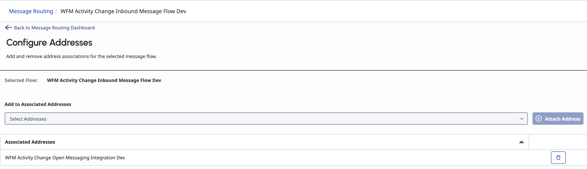

## Testing

For testing, ensure that the targeted agent has a schedule for the day. If you haven't set up your WFM, you may [view the article here](https://help.genesys.cloud/articles/about-workforce-management/ "Goes to the About workforce management article in the Genesys Cloud Resource Center").

Start chatting in the chat group and the bot will start to run.

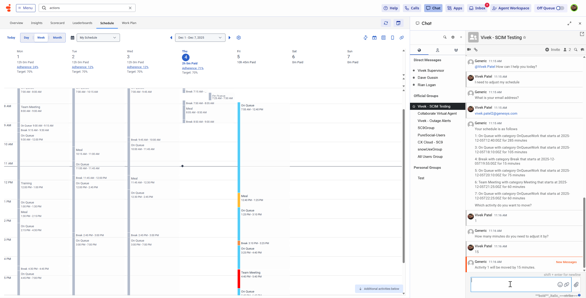

## Additional Resources

- [AWS Lambda Developer Guide](https://docs.aws.amazon.com/lambda/latest/dg/welcome.html "Goes to the AWS Lambda Developer Guide")
- [About the Genesys Cloud data actions integration](https://help.genesys.cloud/articles/about-genesys-cloud-data-actions-integration/ "Goes to the About the Genesys Cloud data actions integration article in the Genesys Cloud Resource Center")
- [Genesys Cloud Functions](https://help.genesys.cloud/articles/about-the-genesys-cloud-function-data-actions-integration/ "Goes to the About the Genesys Cloud Function data actions integration article in the in the Genesys Cloud Resource Center")
- [Genesys Cloud Functions Configuration](https://help.genesys.cloud/articles/add-function-configuration/ "Goes to the Add Function configuration article in the Genesys Cloud Resource Center")
- [About Genesys Cloud Architect](https://help.genesys.cloud/articles/about-architect/ "Goes to the About Architect article in the Genesys Cloud Resource Center")
- [About Genesys Bots](https://help.genesys.cloud/articles/about-genesys-dialog-engine-bot-flows/ "Goes to the About Genesys Dialog Engine Bot Flows in Genesys Cloud Resource Center")
- [wfm-activity-change-blueprint](https://github.com/GenesysCloudBlueprints/wfm-activity-change-blueprint "Goes to the wfm-activity-change-blueprint repository in GitHub") repository
